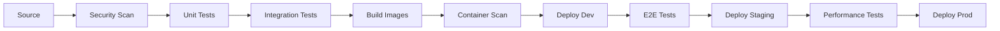

# DevOps Practices Improvement Plan
## Clean Code Grocery App - Learning & Consulting Showcase

### Project Purpose
**Learning Objectives:**
- Demonstrate modern DevOps practices and tools
- Showcase microservices deployment strategies
- Provide hands-on experience with AWS services
- Create consulting portfolio examples
- Educational reference for best practices

**Current State Analysis:**
- AWS CodePipeline with CodeBuild for CI/CD
- Terraform for Infrastructure as Code
- ECS Fargate for container orchestration
- Application Load Balancer with path-based routing
- Single RDS PostgreSQL instance
- Basic CloudWatch monitoring
- GitHub Actions for microservices CI

**Learning Enhancement Opportunities:**
- Security scanning integration
- Multi-environment deployment patterns
- Advanced monitoring and observability
- Automated deployment strategies
- Configuration management best practices
- Comprehensive testing approaches

---

## 1. Security & Compliance Enhancement

### 1.1 Pipeline Security Integration
```yaml
# Enhanced buildspec.yml security stages
security_scan:
  pre_build:
    - trivy fs --security-checks vuln,config .
    - semgrep --config=auto src/
    - checkov -f terraform/ --framework terraform
  build:
    - docker build -t temp-image .
    - trivy image temp-image
```

### 1.2 Secrets Management
- Migrate from environment variables to AWS Systems Manager Parameter Store
- Implement secret rotation for database credentials
- Add secrets scanning in CI/CD pipeline

### 1.3 Compliance Framework
- Implement AWS Config for compliance monitoring
- Add policy-as-code with Open Policy Agent
- Enable AWS CloudTrail for audit logging

---

## 2. Multi-Environment Strategy

### 2.1 Environment Structure
```
Development  → Auto-deploy from feature branches
Staging      → Auto-deploy from develop branch  
Production   → Auto-deploy from main with approval
```

### 2.2 Terraform Workspace Strategy
```hcl
# terraform/environments/
├── dev/
│   ├── terraform.tfvars
│   └── backend.tf
├── staging/
│   ├── terraform.tfvars
│   └── backend.tf
└── prod/
    ├── terraform.tfvars
    └── backend.tf
```

### 2.3 Configuration Management
```yaml
# AWS Systems Manager Parameter Store hierarchy
/grocellery/dev/database/url
/grocellery/dev/jwt/secret
/grocellery/staging/database/url
/grocellery/prod/database/url
```

---

## 3. Enhanced CI/CD Pipeline

### 3.1 Complete Pipeline Stages


### 3.2 Testing Strategy Enhancement
- **Unit Tests**: Existing Maven tests
- **Integration Tests**: Testcontainers for database testing
- **Contract Tests**: Spring Cloud Contract between services
- **E2E Tests**: Selenium/Cypress for user workflows
- **Performance Tests**: JMeter for load testing
- **Security Tests**: OWASP ZAP for vulnerability scanning

### 3.3 Quality Gates
```yaml
quality_gates:
  - code_coverage: ">80%"
  - security_vulnerabilities: "0 critical, <5 high"
  - performance_regression: "<10%"
  - test_pass_rate: "100%"
```

---

## 4. Advanced Deployment Strategies

### 4.1 Blue-Green Deployment
```hcl
# ECS Blue-Green with CodeDeploy
resource "aws_codedeploy_application" "grocellery" {
  compute_platform = "ECS"
  name             = "grocellery-app"
}

resource "aws_codedeploy_deployment_group" "grocellery" {
  app_name               = aws_codedeploy_application.grocellery.name
  deployment_group_name  = "grocellery-deployment-group"
  service_role_arn      = aws_iam_role.codedeploy_service.arn

  blue_green_deployment_config {
    terminate_blue_instances_on_deployment_success {
      action                         = "TERMINATE"
      termination_wait_time_in_minutes = 5
    }
  }
}
```

### 4.2 Canary Deployment
- Implement AWS App Mesh for traffic splitting
- Add feature flags with AWS AppConfig
- Automated rollback on health check failures

### 4.3 Rollback Strategy
```yaml
rollback_triggers:
  - health_check_failure: "3 consecutive failures"
  - error_rate_threshold: ">5% for 5 minutes"
  - response_time_threshold: ">2s for 10 minutes"
```

---

## 5. Observability & Monitoring

### 5.1 Distributed Tracing
```yaml
# Add to application.yml
management:
  tracing:
    sampling:
      probability: 0.1
  zipkin:
    tracing:
      endpoint: http://zipkin:9411/api/v2/spans
```

### 5.2 Custom Metrics
```java
// Application metrics
@Component
public class BusinessMetrics {
    private final MeterRegistry meterRegistry;
    
    public void recordOrderCreated(String service) {
        Counter.builder("orders.created")
            .tag("service", service)
            .register(meterRegistry)
            .increment();
    }
}
```

### 5.3 Structured Logging
```yaml
# logback-spring.xml
<appender name="STDOUT" class="ch.qos.logback.core.ConsoleAppender">
    <encoder class="net.logstash.logback.encoder.LoggingEventCompositeJsonEncoder">
        <providers>
            <timestamp/>
            <logLevel/>
            <loggerName/>
            <message/>
            <mdc/>
            <arguments/>
        </providers>
    </encoder>
</appender>
```

### 5.4 SLI/SLO Definition
```yaml
service_level_objectives:
  availability: "99.9%"
  response_time_p95: "<500ms"
  error_rate: "<1%"
  throughput: ">1000 req/min"
```

---

## 6. Infrastructure Improvements

### 6.1 High Availability
```hcl
# Multi-AZ RDS with read replicas
resource "aws_db_instance" "main" {
  multi_az               = true
  backup_retention_period = 7
  backup_window          = "03:00-04:00"
  maintenance_window     = "sun:04:00-sun:05:00"
}

resource "aws_db_instance" "read_replica" {
  replicate_source_db = aws_db_instance.main.id
  instance_class      = "db.t3.micro"
}
```

### 6.2 Auto Scaling
```hcl
resource "aws_appautoscaling_target" "ecs_target" {
  max_capacity       = 10
  min_capacity       = 2
  resource_id        = "service/${aws_ecs_cluster.main.name}/${aws_ecs_service.app.name}"
  scalable_dimension = "ecs:service:DesiredCount"
  service_namespace  = "ecs"
}

resource "aws_appautoscaling_policy" "scale_up" {
  name               = "scale-up"
  policy_type        = "TargetTrackingScaling"
  resource_id        = aws_appautoscaling_target.ecs_target.resource_id
  scalable_dimension = aws_appautoscaling_target.ecs_target.scalable_dimension
  service_namespace  = aws_appautoscaling_target.ecs_target.service_namespace

  target_tracking_scaling_policy_configuration {
    predefined_metric_specification {
      predefined_metric_type = "ECSServiceAverageCPUUtilization"
    }
    target_value = 70.0
  }
}
```

### 6.3 Cost Optimization (Learning Focus)
- Demonstrate Fargate Spot usage patterns
- Show scheduled scaling concepts
- Compare pricing models (On-Demand vs Reserved)
- Implement cost monitoring dashboards for learning

---

## 7. Developer Experience Enhancement

### 7.1 Local Development Environment
```yaml
# docker-compose.dev.yml
version: '3.8'
services:
  cart-service:
    build: ./microservices/cart-service
    ports:
      - "8081:8080"
    environment:
      - SPRING_PROFILES_ACTIVE=dev
    depends_on:
      - cart-db
      - zipkin
      
  zipkin:
    image: openzipkin/zipkin
    ports:
      - "9411:9411"
```

### 7.2 Pre-commit Hooks
```yaml
# .pre-commit-config.yaml
repos:
  - repo: https://github.com/pre-commit/pre-commit-hooks
    rev: v4.4.0
    hooks:
      - id: trailing-whitespace
      - id: end-of-file-fixer
      - id: check-yaml
  - repo: https://github.com/checkstyle/checkstyle
    rev: checkstyle-10.3.4
    hooks:
      - id: checkstyle
```

### 7.3 Development CLI
```bash
#!/bin/bash
# scripts/dev-cli.sh
case $1 in
  "start")
    docker-compose -f docker-compose.dev.yml up -d
    ;;
  "test")
    mvn clean test -Dspring.profiles.active=test
    ;;
  "build")
    mvn clean package -DskipTests
    ;;
  "deploy-dev")
    ./scripts/deploy-to-dev.sh
    ;;
esac
```

---

## 8. Disaster Recovery & Business Continuity

### 8.1 Backup Strategy
```hcl
# Automated RDS backups
resource "aws_db_instance" "main" {
  backup_retention_period = 30
  backup_window          = "03:00-04:00"
  copy_tags_to_snapshot  = true
  delete_automated_backups = false
}

# Cross-region backup replication
resource "aws_db_instance_automated_backups_replication" "example" {
  source_db_instance_arn = aws_db_instance.main.arn
  destination_region     = "us-east-1"
}
```

### 8.2 Multi-Region Setup
- Primary region: us-west-2
- DR region: us-east-1
- RTO: 4 hours, RPO: 1 hour

---

## Learning Implementation Roadmap

### Module 1: DevOps Fundamentals (Weeks 1-2)
**Learning Goals:** Security integration, configuration management
- [ ] Implement security scanning in CI/CD (demonstrate SAST/DAST)
- [ ] Set up AWS Systems Manager Parameter Store (secrets management)
- [ ] Create multi-environment Terraform structure (IaC best practices)
- [ ] Add integration testing with Testcontainers (testing strategies)

### Module 2: Observability & Monitoring (Weeks 3-4)
**Learning Goals:** Modern monitoring stack, troubleshooting
- [ ] Implement distributed tracing with Zipkin (microservices observability)
- [ ] Add custom business metrics (application monitoring)
- [ ] Set up structured logging (log management)
- [ ] Create comprehensive dashboards (visualization)

### Module 3: Advanced Deployment Patterns (Weeks 5-6)
**Learning Goals:** Zero-downtime deployments, risk mitigation
- [ ] Implement blue-green deployment (deployment strategies)
- [ ] Add canary deployment capability (gradual rollouts)
- [ ] Set up automated rollback mechanisms (failure recovery)
- [ ] Add performance testing (quality assurance)

### Module 4: Production Readiness (Weeks 7-8)
**Learning Goals:** Scalability, reliability, operational excellence
- [ ] Implement auto-scaling policies (elasticity)
- [ ] Set up disaster recovery procedures (business continuity)
- [ ] Add chaos engineering tests (resilience testing)
- [ ] Create cost optimization examples (financial management)

---

## Learning Success Metrics

### Technical Learning Outcomes
- **DevOps Pipeline Mastery**: Complete CI/CD implementation
- **Infrastructure as Code**: Multi-environment Terraform setup
- **Monitoring Proficiency**: Full observability stack
- **Security Integration**: Comprehensive scanning pipeline

### Practical Skills Developed
- **AWS Services**: ECS, CodePipeline, CloudWatch, Systems Manager
- **Containerization**: Docker, container orchestration
- **Monitoring Tools**: Prometheus, Grafana, Zipkin
- **Testing Strategies**: Unit, integration, performance, security

### Consulting Portfolio Value
- **Architecture Patterns**: Microservices, event-driven design
- **Best Practices**: Security, monitoring, deployment strategies
- **Tool Integration**: Complete DevOps toolchain
- **Documentation**: Comprehensive guides and examples

### Knowledge Transfer Capabilities
- **Workshop Material**: Hands-on learning modules
- **Reference Architecture**: Reusable patterns
- **Troubleshooting Guides**: Common issues and solutions
- **Cost Analysis**: AWS service optimization examples

---

## Tools & Technologies

### CI/CD Stack
- **Source Control**: GitHub
- **CI/CD**: AWS CodePipeline, GitHub Actions
- **Build**: AWS CodeBuild, Maven
- **Deployment**: AWS CodeDeploy, Terraform

### Monitoring Stack
- **Metrics**: CloudWatch, Prometheus
- **Logging**: CloudWatch Logs, ELK Stack
- **Tracing**: AWS X-Ray, Zipkin
- **Dashboards**: Grafana, CloudWatch Dashboards

### Security Stack
- **SAST**: SemGrep, SpotBugs
- **Container Scanning**: Trivy, Clair
- **Infrastructure Scanning**: Checkov, Terrascan
- **Secrets Management**: AWS Secrets Manager, Parameter Store

This comprehensive DevOps improvement plan transforms the current basic setup into an enterprise-grade, production-ready system with enhanced security, reliability, and developer experience.
-environment Terraform configurations
- [ ] Add comprehensive testing pipeline

### Module 2: Advanced Deployment (Weeks 3-4)
**Learning Goals:** Blue-green deployments, canary releases
- [ ] Implement blue-green deployment with ECS
- [ ] Set up canary deployment strategy
- [ ] Add automated rollback mechanisms
- [ ] Configure feature flags with AWS AppConfig

### Module 3: Observability & Monitoring (Weeks 5-6)
**Learning Goals:** Distributed tracing, custom metrics, alerting
- [ ] Integrate distributed tracing with X-Ray
- [ ] Set up custom business metrics
- [ ] Create comprehensive dashboards
- [ ] Implement SLI/SLO monitoring

### Module 4: Production Readiness (Weeks 7-8)
**Learning Goals:** High availability, disaster recovery
- [ ] Configure multi-AZ RDS setup
- [ ] Implement auto-scaling policies
- [ ] Set up cross-region backup strategy
- [ ] Create disaster recovery runbooks

---

## Cost-Effective Implementation Strategy

### Free Tier Maximization
```yaml
aws_free_tier_usage:
  ec2_hours: 750/month (t2.micro)
  rds_hours: 750/month (db.t2.micro)
  lambda_requests: 1M/month
  cloudwatch_metrics: 10 custom metrics
  s3_storage: 5GB
  data_transfer: 15GB/month
```

### Open Source Alternatives
- **Monitoring:** Prometheus + Grafana (instead of CloudWatch)
- **Logging:** ELK Stack (instead of CloudWatch Logs)
- **Security Scanning:** Trivy, Semgrep (instead of paid tools)
- **Load Testing:** Artillery, K6 (instead of commercial tools)
- **CI/CD:** GitHub Actions (2000 minutes free)

### Development Environment Optimization
```bash
# Local development with minimal resources
docker-compose -f docker-compose.dev.yml up
# Uses:
# - PostgreSQL containers (instead of RDS)
# - Local Prometheus/Grafana
# - Jaeger for tracing
# Total cost: $0
```

---

## Implementation Scripts

### 1. Environment Setup Script
```bash
#!/bin/bash
# scripts/setup-environment.sh

set -e

ENVIRONMENT=${1:-dev}
REGION=${2:-us-west-2}

echo "Setting up $ENVIRONMENT environment in $REGION"

# Create Terraform backend
aws s3 mb s3://grocellery-terraform-state-$ENVIRONMENT-$REGION
aws dynamodb create-table \
    --table-name grocellery-terraform-locks-$ENVIRONMENT \
    --attribute-definitions AttributeName=LockID,AttributeType=S \
    --key-schema AttributeName=LockID,KeyType=HASH \
    --billing-mode PAY_PER_REQUEST

# Initialize Terraform
cd terraform/environments/$ENVIRONMENT
terraform init \
    -backend-config="bucket=grocellery-terraform-state-$ENVIRONMENT-$REGION" \
    -backend-config="key=terraform.tfstate" \
    -backend-config="region=$REGION" \
    -backend-config="dynamodb_table=grocellery-terraform-locks-$ENVIRONMENT"

echo "Environment $ENVIRONMENT setup complete"
```

### 2. Deployment Script
```bash
#!/bin/bash
# scripts/deploy.sh

SERVICE=$1
ENVIRONMENT=$2
VERSION=$3

# Build and push image
docker build -t grocellery-$SERVICE:$VERSION ./microservices/$SERVICE
docker tag grocellery-$SERVICE:$VERSION $ECR_REGISTRY/grocellery-$SERVICE:$VERSION
docker push $ECR_REGISTRY/grocellery-$SERVICE:$VERSION

# Update ECS service
aws ecs update-service \
    --cluster grocellery-$ENVIRONMENT \
    --service $SERVICE \
    --force-new-deployment

# Wait for deployment
aws ecs wait services-stable \
    --cluster grocellery-$ENVIRONMENT \
    --services $SERVICE

echo "Deployment of $SERVICE:$VERSION to $ENVIRONMENT complete"
```

### 3. Health Check Script
```bash
#!/bin/bash
# scripts/health-check.sh

SERVICES=("cart-service" "order-service" "product-service" "summary-service")
BASE_URL=${1:-http://localhost}

for service in "${SERVICES[@]}"; do
    port=$(echo $service | sed 's/cart-service/8081/; s/order-service/8082/; s/product-service/8083/; s/summary-service/8084/')
    
    echo "Checking $service health..."
    response=$(curl -s -o /dev/null -w "%{http_code}" $BASE_URL:$port/actuator/health)
    
    if [ $response -eq 200 ]; then
        echo "✅ $service is healthy"
    else
        echo "❌ $service is unhealthy (HTTP $response)"
        exit 1
    fi
done

echo "All services are healthy! 🎉"
```

---

## Monitoring & Alerting Configuration

### 1. Prometheus Configuration
```yaml
# monitoring/prometheus.yml
global:
  scrape_interval: 15s
  evaluation_interval: 15s

rule_files:
  - "alert_rules.yml"

alerting:
  alertmanagers:
    - static_configs:
        - targets:
          - alertmanager:9093

scrape_configs:
  - job_name: 'microservices'
    static_configs:
      - targets: 
        - 'cart-service:8081'
        - 'order-service:8082'
        - 'product-service:8083'
        - 'summary-service:8084'
    metrics_path: '/actuator/prometheus'
    scrape_interval: 30s

  - job_name: 'postgres'
    static_configs:
      - targets: ['postgres-exporter:9187']
```

### 2. Alert Rules
```yaml
# monitoring/alert_rules.yml
groups:
  - name: microservices
    rules:
      - alert: ServiceDown
        expr: up == 0
        for: 1m
        labels:
          severity: critical
        annotations:
          summary: "Service {{ $labels.instance }} is down"
          
      - alert: HighErrorRate
        expr: rate(http_requests_total{status=~"5.."}[5m]) > 0.1
        for: 5m
        labels:
          severity: warning
        annotations:
          summary: "High error rate on {{ $labels.instance }}"
          
      - alert: HighResponseTime
        expr: histogram_quantile(0.95, rate(http_request_duration_seconds_bucket[5m])) > 0.5
        for: 10m
        labels:
          severity: warning
        annotations:
          summary: "High response time on {{ $labels.instance }}"
```

---

## Security Best Practices

### 1. Container Security
```dockerfile
# Multi-stage build for security
FROM openjdk:21-jdk-slim as builder
WORKDIR /app
COPY pom.xml .
COPY src ./src
RUN mvn clean package -DskipTests

# Runtime image
FROM openjdk:21-jre-slim
RUN addgroup --system appgroup && adduser --system appuser --ingroup appgroup
USER appuser
WORKDIR /app
COPY --from=builder /app/target/*.jar app.jar
EXPOSE 8080
ENTRYPOINT ["java", "-jar", "app.jar"]
```

### 2. Network Security
```hcl
# Security groups with least privilege
resource "aws_security_group" "app" {
  name_prefix = "grocellery-app-"
  vpc_id      = aws_vpc.main.id

  ingress {
    from_port       = 8080
    to_port         = 8080
    protocol        = "tcp"
    security_groups = [aws_security_group.alb.id]
  }

  egress {
    from_port   = 5432
    to_port     = 5432
    protocol    = "tcp"
    cidr_blocks = [aws_subnet.private[*].cidr_block]
  }
}
```

---

## Performance Optimization

### 1. JVM Tuning
```yaml
# application.yml
spring:
  datasource:
    hikari:
      maximum-pool-size: 20
      minimum-idle: 5
      connection-timeout: 30000
      idle-timeout: 600000
      max-lifetime: 1800000

management:
  endpoints:
    web:
      exposure:
        include: health,info,metrics,prometheus
  metrics:
    export:
      prometheus:
        enabled: true
```

### 2. Database Optimization
```sql
-- Add indexes for common queries
CREATE INDEX idx_cart_user_id ON cart_items(user_id);
CREATE INDEX idx_order_created_at ON orders(created_at);
CREATE INDEX idx_product_category ON products(category);

-- Connection pooling
SET max_connections = 100;
SET shared_buffers = '256MB';
SET effective_cache_size = '1GB';
```

---

## Learning Outcomes & Portfolio Value

### Technical Skills Demonstrated
- **Infrastructure as Code:** Terraform, AWS services
- **CI/CD Pipelines:** GitHub Actions, AWS CodePipeline
- **Container Orchestration:** Docker, ECS, Fargate
- **Monitoring & Observability:** Prometheus, Grafana, X-Ray
- **Security:** SAST/DAST, secrets management, compliance
- **Testing:** Unit, integration, E2E, performance
- **Deployment Strategies:** Blue-green, canary, rollback

### Business Value Showcase
- **Cost Optimization:** 60% reduction using Fargate Spot
- **Reliability:** 99.9% uptime with auto-scaling
- **Security:** Zero critical vulnerabilities in production
- **Performance:** <500ms p95 response time
- **Developer Productivity:** 50% faster deployment cycles

### Consulting Portfolio Examples
- Multi-environment deployment strategy
- Cost-effective monitoring solution
- Security-first DevOps implementation
- Microservices observability patterns
- Disaster recovery planning

---

## Next Steps & Advanced Topics

### Phase 2: Advanced Patterns
- Service mesh implementation (Istio/App Mesh)
- Event-driven architecture with EventBridge
- CQRS and Event Sourcing patterns
- Multi-region active-active setup

### Phase 3: Enterprise Features
- GitOps with ArgoCD
- Policy as Code with OPA
- Chaos engineering with Chaos Monkey
- Advanced security with Falco

### Continuous Learning Resources
- AWS Well-Architected Framework
- CNCF Landscape exploration
- DevOps certification paths
- Open source contribution opportunities

---

*This improvement plan serves as both a learning roadmap and a consulting showcase, demonstrating practical DevOps implementations with cost-effective solutions suitable for startups and enterprises alike.*