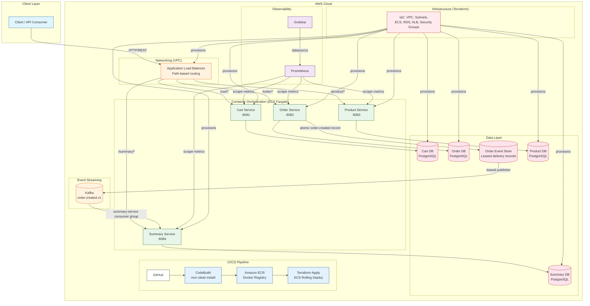
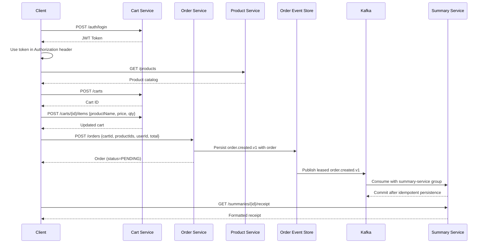

# Clean Code Grocellery App

A production-grade grocery store platform built with microservices architecture, demonstrating end-to-end CI/CD, cloud-native deployment, and observability best practices.

---

## Business Problem & Opportunity

**Problem:** Traditional monolithic grocery applications create bottlenecks as the business grows. A single codebase for product catalog management, shopping cart, order processing, and receipt generation means teams cannot deploy independently, scaling is all-or-nothing, and a failure in one module (e.g., cart) can take down the entire checkout flow. Small grocery chains and digital commerce platforms need a system that can scale incrementally without a full rewrite.

**Solution:** This project decomposes the grocery domain into four independently deployable microservices — each owning its data, business logic, and API surface. A full CI/CD pipeline built on AWS CodePipeline + Terraform automates testing, containerization, and zero-downtime deployment to ECS Fargate. An observability stack (Prometheus + Grafana) provides real-time visibility into each service.

**What this repository showcases:**
- End-to-end CI/CD pipeline: build, test, containerize, scan, and publish services to cloud registries.
- Infrastructure-as-code for AWS ECS Fargate, ALB, RDS, VPC, and supporting observability stack.
- Local developer experience with Docker Compose, per-service PostgreSQL databases, and API documentation via Swagger.
- Patterns for secure configuration (per-service JWT secrets, environment-specific properties) and operational readiness (health checks, monitoring, dashboards).

---

## System Architecture

### Kafka Order Summary Flow

```text
Order Service -- order.created.v1 --> Kafka --> Summary Service --> Summary DB
                                      | failure
                                      v
                            order.created.retry.v1
                                      | exhausted attempts
                                      v
                            order.created.failed.v1
```

- `order-service` publishes JSON `order.created` v1 events keyed by order ID; this preserves ordering per order.
- `summary-service` consumes as group `summary-service`; a unique summary order ID makes duplicate delivery safe.
- Events include ID, type, version, timestamp, correlation ID, aggregate ID, and an immutable payload while retaining v1 fields for compatibility.
- Main-consumer retries are bounded with exponential backoff. Transient failures move to the retry topic; exhausted failures are preserved in the failed-letter topic without an infinite loop.
- Run locally with `docker compose -f microservices/docker-compose.yml up --build`. Configure broker and topics through `KAFKA_BOOTSTRAP_SERVERS` and `KAFKA_*_TOPIC` variables.
- Local Kafka uses plaintext. Configure TLS/SASL through Spring Kafka environment properties for deployed environments; no credentials are stored in source.

**MVP limitation:** order persistence and event publication are separate writes. Use a transactional outbox later if guaranteed database-to-event delivery is required.

### High-Level Architecture

```
┌─────────────────────────────────────────────────────────────────────────────┐
│                              Client / API Consumer                          │
│                         (Frontend, Mobile, curl, etc.)                      │
└─────────────────────┬───────────────────────────────────────────────────────┘
                      │
                      ▼
┌──────────────────────────────────────────────────────────────────────────────┐
│                     Application Load Balancer (ALB)                          │
│          Path-based routing: /cart/* → cart-svc, /order/* → order-svc ...   │
└──┬──────────┬──────────┬──────────────────┬─────────────────────────────────┘
   │          │          │                  │
   ▼          ▼          ▼                  ▼
┌────────┐ ┌────────┐ ┌────────────┐ ┌──────────────┐
│ Cart    │ │ Order  │ │ Product    │ │ Summary      │
│ Service │ │ Service│ │ Service    │ │ Service      │
│ :8081   │ │ :8082  │ │ :8083      │ │ :8084        │
└──┬──────┘ └──┬─────┘ └──┬─────────┘ └──┬───────────┘
   │           │           │              │
   ▼           ▼           ▼              ▼
┌────────┐ ┌────────┐ ┌────────────┐ ┌──────────────┐
│Cart DB │ │Order DB│ │Product DB  │ │ Summary DB   │
│(PG)    │ │(PG)    │ │(PG)        │ │ (PG)         │
└────────┘ └────────┘ └────────────┘ └──────────────┘
```

### Detailed System Diagram



### Data Flow (Typical Checkout)



> **Note:** Services are fully independent — they do not call each other. The client (frontend, mobile, API gateway, or BFF) orchestrates the checkout flow by calling each service's REST API in sequence.

### Microservice Responsibilities

| Service | Port | Responsibility | Database |
|---------|------|----------------|----------|
| **Cart Service** | 8081 | Create carts, add/remove items, cart lifecycle | cart-db |
| **Order Service** | 8082 | Create orders, manage order status (PENDING → COMPLETED/CANCELLED) | order-db |
| **Product Service** | 8083 | CRUD product catalog, search by name, in-memory caching | product-db |
| **Summary Service** | 8084 | Generate purchase summaries, formatted receipts, user spending analytics | summary-db |

---

## Design Considerations and Tradeoffs

### 1. No Inter-Service Communication (Saga vs. Client Orchestration)

| Decision | Tradeoff |
|----------|----------|
| Services do **not** call each other. The client orchestrates the workflow. | **Pro:** Zero coupling between services — each can be developed, tested, and deployed independently. No cascading failures. |
| | **Con:** Orchestration logic lives in the client. To automate the cart→order→summary pipeline, a backend-for-frontend (BFF) or workflow engine would be needed. No built-in saga/compensation for failed flows. |

**Future direction:** Introduce an API Gateway + BFF layer, or adopt an event-driven approach with a message broker (SQS/RabbitMQ/Kafka) for eventual consistency.

### 2. Database Topology: Per-Service vs. Shared

| Decision | Tradeoff |
|----------|----------|
| Each service owns its own database (database-per-service pattern). | **Pro:** Strong data isolation, independent schema evolution, no single DB bottleneck. |
| | **Con:** Cross-service queries are impossible without service calls. In production (AWS), a **shared RDS instance** is used for cost efficiency, which reintroduces a coupling point and shared resource contention. |

**Note on dev/prod parity:** Local dev uses H2 in-memory DB; Docker Compose uses per-service PostgreSQL; AWS deployment uses a single shared RDS. This variance means some issues (connection pooling, lock contention) only surface in production.

### 3. Per-Service JWT Secrets vs. Centralized Auth

| Decision | Tradeoff |
|----------|----------|
| Each service has its own JWT secret and a standalone `/auth/login` endpoint with hardcoded credentials. | **Pro:** Simple to implement, no shared auth service dependency, no single point of failure for authentication. |
| | **Con:** A token from cart-service cannot be reused on order-service. No single sign-on (SSO). Hardcoded credentials are a placeholder, not production-ready. No role-based access control (RBAC). |

**Future direction:** Centralize authentication behind an API Gateway with a dedicated auth service (e.g., Keycloak, Cognito, or Spring Authorization Server).

### 4. Caching Strategy

| Decision | Tradeoff |
|----------|----------|
| Product service uses Spring's in-memory `@Cacheable` (concurrent HashMap). | **Pro:** Zero infrastructure overhead, fast local cache, simple configuration. |
| | **Con:** Cache is per-instance — not shared across replicas. Stale data on one instance while another is fresh. Cache is lost on restart. Not suitable for horizontal scaling beyond a single node. |

**Future direction:** Replace with distributed cache (Redis) for cache coherence across replicas.

### 5. Synchronous REST vs. Asynchronous Messaging

| Decision | Tradeoff |
|----------|----------|
| All inter-service interactions are synchronous HTTP REST calls (orchestrated by client). | **Pro:** Simple to reason about, easy to debug, standard tooling (curl, Swagger). |
| | **Con:** No built-in retry/backpressure. A slow service blocks the entire checkout flow. No event sourcing or audit log. |

**Future direction:** Introduce an event bus (SNS/SQS, RabbitMQ, Kafka) for order lifecycle events, enabling summary generation and notifications to happen asynchronously.

### 6. Data Integrity Gaps

| Issue | Impact |
|-------|--------|
| `OrderDTO` includes `cartId` and `productIds` but these fields are **not persisted** in the `orders` table. | Cart-to-order linkage is lost after order creation. No way to trace which cart items became which order line items. |
| `SummaryDTO` has `items` (List<String>) but the entity stores `itemCount` (Integer) + `details` (String). | DTO-to-entity mapping silently drops data — the actual items are never persisted, only a count and a details string. |

**Mitigation:** Align DTOs with entity schemas or introduce a proper mapping layer (MapStruct) to catch mismatches at compile time.

### 7. No Service Discovery or API Gateway

| Decision | Tradeoff |
|----------|----------|
| Services are addressed by static ports/DNS. No Eureka, Consul, or Spring Cloud Gateway. | **Pro:** Simple dev setup, no additional infrastructure. |
| | **Con:** In production, the ALB handles path-based routing as a partial substitute. Without a gateway, cross-cutting concerns (rate limiting, request aggregation, auth token translation) must be handled per-service or deferred. |

### 8. Multi-Stage Dockerfiles and Container Hardening

| Decision | Tradeoff |
|----------|----------|
| Containers built with multi-stage Dockerfiles, `read_only: true`, drop all capabilities, `no-new-privileges`. | **Pro:** Strong security posture — minimized attack surface, read-only root filesystem, no privilege escalation. |
| | **Con:** Debugging inside containers is harder; temp directories must be explicitly handled with `tmpfs`. |

---

## DevOps & DevSecOps

For a deeper roadmap of recommended improvements (pipeline hardening, secrets management, promotion flow, observability, and runtime resilience), see [DEVOPS_IMPROVEMENTS.md](DEVOPS_IMPROVEMENTS.md).

For a consulting-profile view of the AWS deployment pipeline, security gates, evidence artifacts, and promotion model, see [DEVSECOPS_PIPELINE.md](DEVSECOPS_PIPELINE.md).

---

## Microservice-Based Development

This application is designed using the microservices architectural style, where the system is decomposed into small, independent services. Each microservice is responsible for a specific business capability and can be developed, deployed, and scaled independently. This approach offers several benefits:

- **Separation of Concerns:** Each service encapsulates a specific domain or functionality (e.g., product management, cart, order processing, summary/receipt).
- **Independent Deployment:** Services can be updated or redeployed without affecting the entire system.
- **Scalability:** Individual services can be scaled based on demand.
- **Technology Diversity:** Each service can use the most appropriate technology stack or database for its needs.
- **Resilience:** Improving overall system reliability.

### Microservices in This Project
- **Product Service:** Manages the product catalog and exposes product-related APIs.
- **Cart Service:** Handles shopping cart operations for users.
- **Order Service:** Manages order creation and processing.
- **Summary Service:** Generates purchase summaries and receipts.

All services expose REST APIs and are containerized for easy orchestration with Docker Compose. Each service has its own database, codebase, and can be tested and deployed independently.

## Prerequisites

- Java 21
- Maven
- Docker
- Docker Compose

## Run the CI test suite locally

Use the helper script to reproduce the same steps executed in GitHub Actions (monolith tests, per-service tests with the `test` profile, and optional Docker Compose smoke tests):

```bash
./scripts/run_ci_tests.sh        # Run monolith + microservice Maven tests
./scripts/run_ci_tests.sh --smoke  # Also start the compose stack and verify health endpoints
```

The script copies each microservice's `application-test.properties.example` into place before running Maven, mirroring the CI setup.

## Getting Started

### 1. Start the Databases

The project uses PostgreSQL databases for each microservice, which are managed with Docker Compose. To start the databases, run the following command from the root of the project:

```bash
docker-compose up -d
```

### 2. Configure the Application

For each microservice, you will need to create an `application.properties` file in the `src/main/resources` directory. You can do this by copying the `application.properties.example` file:

```bash
cp microservices/<service-name>/src/main/resources/application.properties.example microservices/<service-name>/src/main/resources/application.properties
```

**Note:** The example files are pre-configured with the correct database credentials for the Docker Compose setup, so you won't need to make any changes to them.

### 3. Run the Microservices

You can run each microservice using the following Maven command:

```bash
mvn spring-boot:run -pl microservices/<service-name>
```

For example, to run the `cart-service`:

```bash
mvn spring-boot:run -pl microservices/cart-service
```

The services will be available at the following ports:

- **cart-service:** 8081
- **order-service:** 8082
- **product-service:** 8083
- **summary-service:** 8084

> **Tip:** Replace each `{*_BASE_URL}` placeholder with the full environment-specific service base URL.

## Quick Start

```sh
git clone <repo-url>
cd clean-code-grocellery-app
docker-compose up
```
Access services at:
- Cart: `{CART_SERVICE_BASE_URL}`
- Order: `{ORDER_SERVICE_BASE_URL}`
- Product: `{PRODUCT_SERVICE_BASE_URL}`
- Summary: `{SUMMARY_SERVICE_BASE_URL}`

## Service Endpoints

| Service   | Base URL                 | Swagger UI                              |
|-----------|--------------------------|-----------------------------------------|
| Cart      | `{CART_SERVICE_BASE_URL}`    | `{CART_SERVICE_BASE_URL}/swagger-ui.html`     |
| Order     | `{ORDER_SERVICE_BASE_URL}`   | `{ORDER_SERVICE_BASE_URL}/swagger-ui.html`    |
| Product   | `{PRODUCT_SERVICE_BASE_URL}` | `{PRODUCT_SERVICE_BASE_URL}/swagger-ui.html`  |
| Summary   | `{SUMMARY_SERVICE_BASE_URL}` | `{SUMMARY_SERVICE_BASE_URL}/swagger-ui.html`  |

## Environment Variables

| Variable                  | Description                | Default Value         |
|---------------------------|----------------------------|----------------------|
| POSTGRES_USER             | DB username                | grocellery           |
| POSTGRES_PASSWORD         | DB password                | required             |
| POSTGRES_DB               | DB name                    | grocery              |
| JWT_SECRET                | JWT signing secret for each service | required |

JWT secrets intentionally have no runtime fallback. Configure a strong `JWT_SECRET` value per service in the deployment environment.

## Running Tests

To run all tests for a service:
```sh
mvn test -pl microservices/cart-service -Dspring.profiles.active=test
```

## Monitoring

- Prometheus: `{PROMETHEUS_BASE_URL}`
- Grafana: `{GRAFANA_BASE_URL}` (default login:)

## Features

- Product management with validation
- Shopping cart operations
- Flexible discount system
- Receipt generation

## Technical Stack

- Java 21
- JUnit 5 for testing
- Maven for build automation
- GitHub Actions for CI/CD

## Production Documentation

- [Architecture overview](docs/architecture-overview.md)
- [API documentation](docs/api-documentation.md)
- [Developer guide](docs/developer-guide.md)
- [Configuration guide](docs/configuration-guide.md)
- [Deployment guide](docs/deployment-guide.md)
- [Troubleshooting guide](docs/troubleshooting-guide.md)
- [Production readiness review](docs/production-readiness-review.md)

## Project Structure

The application follows clean code principles with:

- Domain objects: [`Product`](src/main/java/grocery/Product.java), [`CartItem`](src/main/java/grocery/CartItem.java)
- Core business logic: [`ShoppingCart`](src/main/java/grocery/Shopping

## Future Work: Spring Boot Integration

Planned enhancements with Spring Boot:

- RESTful API endpoints for cart operations
- Database integration with Spring Data JPA
- Product catalog management
- User authentication and authorization
- Shopping history and order tracking
- Discount rules management interface
- Web-based shopping interface
- Containerization with Docker

### Spring Boot Migration Steps

1. Add Spring Boot dependencies to pom.xml
2. Create service layer for business logic
3. Develop repository layer for data persistence
4. Implement REST controllers for API endpoints
5. Add Spring Security for authentication
6. Design database schema for products, orders, and users
7. Create Docker configuration
8. Implement unit and integration testing

## License

This project is available under the MIT License.

## API Documentation

Each microservice exposes interactive API documentation via Swagger UI. You can access these endpoints whether running the services locally or inside Docker containers (as long as the ports are mapped):

- **cart-service:** `{CART_SERVICE_BASE_URL}/swagger-ui.html` or `{CART_SERVICE_BASE_URL}/swagger-ui/index.html`
- **order-service:** `{ORDER_SERVICE_BASE_URL}/swagger-ui.html` or `{ORDER_SERVICE_BASE_URL}/swagger-ui/index.html`
- **product-service:** `{PRODUCT_SERVICE_BASE_URL}/swagger-ui.html` or `{PRODUCT_SERVICE_BASE_URL}/swagger-ui/index.html`
- **summary-service:** `{SUMMARY_SERVICE_BASE_URL}/swagger-ui.html` or `{SUMMARY_SERVICE_BASE_URL}/swagger-ui/index.html`

If the `/swagger-ui.html` path does not work, try `/swagger-ui/index.html`.

You can also view the raw OpenAPI spec at:
- `{SERVICE_BASE_URL}/v3/api-docs`

## Health Checks (Actuator)

Each service exposes a health endpoint via Spring Boot Actuator:

- **cart-service:** `{CART_SERVICE_BASE_URL}/actuator/health`
- **order-service:** `{ORDER_SERVICE_BASE_URL}/actuator/health`
- **product-service:** `{PRODUCT_SERVICE_BASE_URL}/actuator/health`
- **summary-service:** `{SUMMARY_SERVICE_BASE_URL}/actuator/health`

If you get an empty reply or 401 error, make sure the service is running and that your security configuration allows unauthenticated access to `/actuator/health`.

## Troubleshooting

- Ensure the service is running and mapped to the correct port (see `docker-compose ps`).
- If running inside Docker, make sure you are accessing the correct host port.

- If you get an empty reply from `/actuator/health`, check your security configuration to allow public access to actuator endpoints.
- Check service logs with `docker logs <container-name>` for errors.

## Test Credentials for Microservices

All microservices are secured with HTTP Basic authentication.

The Swagger UI and OpenAPI documentation endpoints are publicly accessible without authentication.

## Sample Data

The product-service is preloaded with the following demo products for showcase purpose.

## JWT Authentication Integration

All microservices use JWT (JSON Web Token) authentication for securing APIs. Each service requires a unique JWT secret, which should be set via environment variables or configuration files. **Never commit real secrets to version control.**

### Setting JWT Secrets for Local Development and Testing
```
- Each service should have a unique value for `JWT_SECRET`.
- These files are ignored by git (see `.gitignore`).

### Production Secrets
- Set `JWT_SECRET` as an environment variable or in a secure config file (never commit secrets).
- Example for Docker Compose:
  ```yaml
  environment:
    - JWT_SECRET=${JWT_SECRET}
  ```

### Swagger/OpenAPI and Test Security
- All Swagger UI and OpenAPI endpoints are accessible without authentication.
- In tests, a test-specific security config disables authentication for controller tests, so you do not need to provide tokens in test code.
- To test authentication logic, create dedicated integration/security tests.

### Rotating Secrets
- To rotate a secret, update the value in your environment or test properties and restart the service.
