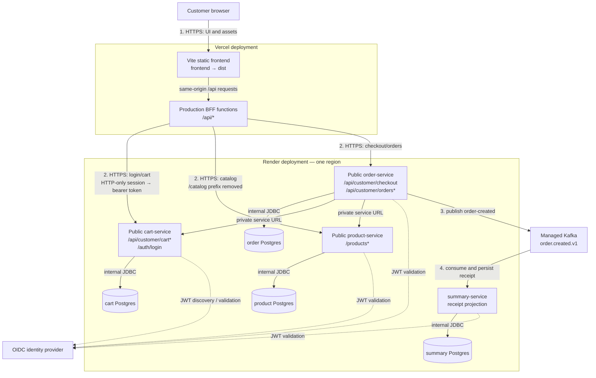

# Deployment roadmap: Render backend and Vercel frontend

This document is the production rollout plan for this repository's four Spring
Boot services and Vite/React frontend. It is deliberately configuration-first:
no production secrets, database URLs, or Kafka credentials belong in Git.

## Target architecture



Keep the four databases and all Render services in one Render region. Render
services should use the database's **internal** address and peer services'
private addresses wherever both ends are on Render. The Vercel BFF is outside
that network, so it needs HTTPS access to the public backend endpoints (or an
API gateway added in front of private services).

The numbered arrows show the frontend/backend integration boundary: the browser
only calls Vercel; the BFF selects the owning backend and injects the bearer
token from its HTTP-only session cookie. Cart, product, and order must be
reachable by that BFF, while order-to-cart/product and service-to-database
traffic stays on Render's private network. The summary service is asynchronous:
checkout succeeds after the order is persisted, and the receipt follows after
Kafka consumption.

## Readiness decision

Do not deploy the frontend until the BFF gap below is closed.

The frontend is built with Vite (`frontend/package.json`), not Next.js. Its
current `/api/*` proxy is implemented by `frontend/server/vite-bff-plugin.ts`.
`configureServer` runs only during `vite dev`; it is not included in `dist`.
The browser therefore receives 404s for `/api/auth/*`, `/api/customer/*`, and
`/api/catalog/*` after a plain Vercel static deployment.

Before the first production frontend deploy, implement one of these options:

1. **Recommended: Vercel BFF functions.** Add Vercel Functions that reproduce
   the routing and cookie handling in `vite-bff-plugin.ts`. Store the three
   Render public service URLs as server-only Vercel environment variables.
2. **Alternative: public direct APIs.** Change the client adapters to call
   explicit service URLs, expose the relevant Render services, and set each
   service's CORS allowlist to the Vercel production and preview origins. Do
   not put secrets in `VITE_*` variables: they are bundled into browser code.

The rest of this roadmap assumes option 1. The BFF must preserve the existing
route contract:

| Browser path | Upstream service | Upstream path |
| --- | --- | --- |
| `/api/auth/login` | cart | `/auth/login` |
| `/api/auth/logout`, `/api/auth/me` | BFF | session-cookie handling |
| `/api/customer/cart*` | cart | unchanged |
| `/api/customer/checkout`, `/api/customer/orders*` | order | unchanged |
| `/api/catalog/products*` | product | strip `/catalog` |
| other `/api/*` paths | product | unchanged |

Forward the `Authorization` header derived from the HTTP-only session cookie;
never return the JWT to JavaScript. Reject unknown methods and upstream URLs,
apply request-size/time limits, and return a generic 502 for upstream failures.

## Phase 0 — preflight

1. Merge the Vite alias fix and require the frontend CI workflow to pass.
2. Choose a real OpenID Connect issuer. Production profiles set
   `security.jwt.demo-enabled=false`; the embedded demo issuer is not a
   production identity provider.
3. Provision a managed Kafka offering reachable from Render. The order and
   summary services require it at startup (`spring.kafka.admin.fail-fast=true`).
4. Create separate Render Postgres databases: `grocery-cart`,
   `grocery-product`, `grocery-order`, and `grocery-summary`. Do not share one
   schema across services.
5. Pick names before configuring URLs, for example `grocery-cart-api`,
   `grocery-product-api`, `grocery-order-api`, and `grocery-summary-worker`.

## Phase 1 — configure Render data and shared secrets

Create the four databases and record each database's internal host, port,
database name, username, and password from Render's **Connect** panel. Convert
the internal connection details to the Spring JDBC form:

```text
SPRING_DATASOURCE_URL=jdbc:postgresql://<internal-host>:5432/<database>
SPRING_DATASOURCE_USERNAME=<database-user>
SPRING_DATASOURCE_PASSWORD=<database-password>
```

Create one Render environment group named `grocery-production-shared`:

```dotenv
SPRING_PROFILES_ACTIVE=prod
SERVER_PORT=10000
JWT_ISSUER_URI=https://<identity-provider>/
JWT_AUDIENCE=grocery-api
CORS_ALLOWED_ORIGINS=https://<frontend>.vercel.app
KAFKA_BOOTSTRAP_SERVERS=<broker-1:port,broker-2:port>
KAFKA_ORDER_CREATED_TOPIC=order.created.v1
```

Add the Vercel preview domain only if preview deployments are intentionally
allowed to call production APIs. Prefer a separate staging stack instead.

For TLS/SASL Kafka providers, add the provider-specific Spring properties to
the services that use Kafka (order and summary). A typical SASL/SSL setup is:

```dotenv
SPRING_KAFKA_PROPERTIES_SECURITY_PROTOCOL=SASL_SSL
SPRING_KAFKA_PROPERTIES_SASL_MECHANISM=PLAIN
SPRING_KAFKA_PROPERTIES_SASL_JAAS_CONFIG=org.apache.kafka.common.security.plain.PlainLoginModule required username="<key>" password="<secret>";
```

Mark database passwords and Kafka credentials as secret values. Do not use
`POSTGRES_HOST_AUTH_METHOD=trust`, Compose defaults, or demo identity settings
in Render.

## Phase 2 — deploy Render services

Create each service with **New → Web Service → Docker** from the GitHub
repository. Use the repository root as the Docker build context; each existing
Dockerfile copies the root `pom.xml` and its service module. Set the following
per-service configuration:

| Render service | Dockerfile path | Health check | Public access | Additional variables |
| --- | --- | --- | --- | --- |
| `grocery-cart-api` | `microservices/cart-service/Dockerfile` | `/actuator/health` | Required for the Vercel BFF | its cart DB variables |
| `grocery-product-api` | `microservices/product-service/Dockerfile` | `/actuator/health` | Required for the Vercel BFF | its product DB variables |
| `grocery-order-api` | `microservices/order-service/Dockerfile` | `/actuator/health` | Required for the Vercel BFF | its order DB, Kafka, cart and product URLs |
| `grocery-summary-worker` | `microservices/summary-service/Dockerfile` | `/actuator/health` | Only public if the BFF reads receipts directly | its summary DB and Kafka variables |

Set the start command to the Dockerfile `ENTRYPOINT`; do not override it.
Use the shared environment group plus the service-specific database values.
Set `SERVER_PORT=10000` so the process listens on Render's conventional web
port. Each Dockerfile exposes 8080, but the Spring production profiles honor
`SERVER_PORT`.

For `grocery-order-api`, configure private service addresses (replace the
placeholders with Render's discovery hostnames or private URLs):

```dotenv
CART_SERVICE_BASE_URL=http://grocery-cart-api:10000
PRODUCT_SERVICE_BASE_URL=http://grocery-product-api:10000
```

If order-to-cart or order-to-product traffic must use TLS, use the corresponding
Render private HTTPS address instead. Keep these addresses server-only.

Deploy in this order:

1. Cart and product databases, then cart and product services.
2. Order database, Kafka topics (`order.created.v1`, retry/failed topics if
   used by the configured consumer), then order service.
3. Summary database, then summary service.

Every service must return HTTP 200 from `/actuator/health` before proceeding.
Render uses the configured health check before directing traffic to a new
instance, so this endpoint is the deployment gate.

## Phase 3 — add the production Vercel BFF

Create a serverless implementation of the proxy before deploying Vercel. Keep
the Vite development plugin for local use, but extract shared route selection
from `frontend/server/proxy.ts` so development and production cannot drift.

Configure the Vercel project's production environment variables as **secret**:

```dotenv
CART_SERVICE_URL=https://grocery-cart-api.onrender.com
ORDER_SERVICE_URL=https://grocery-order-api.onrender.com
PRODUCT_SERVICE_URL=https://grocery-product-api.onrender.com
```

These are intentionally not prefixed with `VITE_`; Vite exposes `VITE_*`
values to the browser. A BFF function needs `CART_SERVICE_URL`,
`ORDER_SERVICE_URL`, and `PRODUCT_SERVICE_URL` only at runtime.

If the function route lives at the Vercel project root, configure rewrites so
the SPA history fallback does not intercept `/api/*`. Example policy:

```json
{
  "rewrites": [
    { "source": "/api/(.*)", "destination": "/api/$1" },
    { "source": "/(.*)", "destination": "/index.html" }
  ]
}
```

Adapt this only after selecting the function file layout; Vercel Functions take
precedence over static output, and the SPA fallback must remain last.

## Phase 4 — configure Vercel

Import the GitHub repository as a new Vercel project with these exact Build and
Deployment settings:

| Setting | Value |
| --- | --- |
| Root Directory | `frontend` |
| Framework Preset | `Vite` |
| Install Command | `npm ci` |
| Build Command | `npm run build` |
| Output Directory | `dist` |
| Production branch | `main` (or the approved release branch) |
| Node.js | the version in `frontend/.nvmrc` |

Do not select Next.js based on the stale `frontend/README.md`; the deployable
application is Vite, as confirmed by its package scripts and `vite.config.ts`.
Enable preview deployments for pull requests only after a staging backend and
staging environment variables are available. Preview UI code must not silently
target production checkout services.

## Phase 5 — validation and launch

Run these gates against the production URLs after Render health checks pass:

```bash
curl --fail --silent --show-error https://grocery-cart-api.onrender.com/actuator/health
curl --fail --silent --show-error https://grocery-product-api.onrender.com/actuator/health
curl --fail --silent --show-error https://grocery-order-api.onrender.com/actuator/health
curl --fail --silent --show-error https://grocery-summary-worker.onrender.com/actuator/health
```

Then validate from the deployed Vercel URL:

1. Load products through `/api/catalog/products`.
2. Log in and confirm the session cookie is `HttpOnly`, `Secure`, and
   `SameSite=Lax`.
3. Create a cart, change a quantity, remove an item, and refresh the page.
4. Submit checkout at `/api/customer/checkout` with an idempotency key.
5. Confirm the order event reaches Kafka and a receipt/summary appears.
6. Confirm a browser from an unapproved origin is rejected by CORS.
7. Review Render logs for Flyway migrations, datasource errors, JWT failures,
   and Kafka authentication failures; review Vercel function logs for upstream
   4xx/5xx responses without logging tokens or request bodies.

Deploy changes with a canary process: first deploy backend changes and wait for
health checks, then deploy the BFF, then the static frontend. Keep the previous
Vercel deployment and Render revisions available for rollback. Database changes
must be backward-compatible for at least one frontend/backend deployment cycle.

## Operational ownership checklist

- Enable Render deploy notifications and Vercel deployment alerts.
- Monitor `/actuator/health`, error rate, p95 latency, Kafka consumer lag, and
  failed-topic growth.
- Rotate database, Kafka, and identity-provider credentials through the Render
  environment group and Vercel project settings; redeploy affected services.
- Back up each Postgres database and regularly test restoration.
- Use a dedicated staging environment before enabling production preview URLs.
- Replace the current all-or-nothing public-service model with a gateway or
  private connectivity solution if backend endpoints must not be internet
  reachable from Vercel.

## Provider references

- [Render web services](https://render.com/docs/web-services) and
  [Docker deploys](https://render.com/docs/docker)
- [Render health checks](https://render.com/docs/health-checks) and
  [Postgres internal connections](https://render.com/docs/postgresql-creating-connecting)
- [Vite on Vercel](https://vercel.com/docs/frameworks/frontend/vite) and
  [Vercel build configuration](https://vercel.com/docs/builds/configure-a-build)
