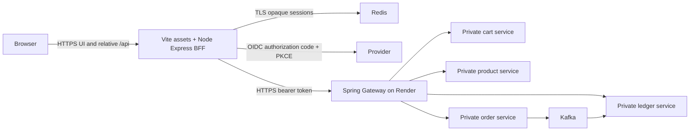

# Deployment roadmap: Render backend and Vercel frontend

## Target architecture

Only Gateway needs public backend ingress. Browser authentication terminates at
the Vercel BFF; JWTs stay in Redis and are forwarded server-side. The Gateway
and services validate the same real issuer/audience. Receipt projection remains
asynchronous, and pending receipt availability must never create another order.
Each service owns its Postgres database. Keep the services and their databases
in one Render region; use internal database and service addresses.

The application uses Vite, with a shared Express BFF running as Vercel Node
functions. Deployment does not use a Vite server plugin or a Next.js runtime.
See [Vercel configuration](frontend-vercel-deployment.md) for exact variables,
project settings and the real staging gate.

## Phase 0: release prerequisites

- Pass frontend CI and targeted backend/Gateway checks.
- Select and configure a real OIDC provider, registered web client, HTTPS
  callback, JWKS and API audience. Production demo identity is prohibited.
- Provision separate production and staging infrastructure, including TLS
  Redis with different session namespaces and two dedicated staging users.
- Provision managed Kafka reachable from Render. Order and ledger startup
  require the broker; create `order.created.v1` and configured retry topics.
- Provision four independent Postgres databases and configure secrets through
  Render/Vercel settings. Do not commit provider, database or broker credentials.

## Phase 1: Render infrastructure

For each service set `SPRING_PROFILES_ACTIVE=prod`, `SERVER_PORT=10000`,
`JWT_ISSUER_URI`, `JWT_AUDIENCE`, and its database variables:
`SPRING_DATASOURCE_URL=jdbc:postgresql://<internal-host>:5432/<database>`,
`SPRING_DATASOURCE_USERNAME`, `SPRING_DATASOURCE_PASSWORD`.

Order and ledger additionally require `KAFKA_BOOTSTRAP_SERVERS` and
`KAFKA_ORDER_CREATED_TOPIC`. Configure the managed broker's supported SASL/TLS
Spring properties through secrets; preserve TLS verification. Order needs
private `CART_SERVICE_BASE_URL` and `PRODUCT_SERVICE_BASE_URL`. Gateway requires
its private service destinations and the same trusted JWT issuer/audience;
use the Gateway module's configuration contract rather than public direct
service URLs in the BFF.

Build Docker services with repository-root context and the service's Dockerfile.
Deploy databases, cart/product, Kafka/order, ledger, then Gateway. Use the
module's health endpoint and confirm datasource migrations, broker connectivity,
JWT validation and receipt consumer readiness. Make health access available to
Render without exposing internal actuator details to the browser. Private
services must not be exposed as an alternative browser/BFF route.

## Phase 2: Vercel production functions and static assets

Configure Root Directory `frontend`, Vite, `npm ci`, `npm run build`, `dist`, and
the pinned Node runtime. Configure the BFF's `GATEWAY_URL`, `PUBLIC_ORIGIN`, OIDC
and Redis settings per [the frontend deployment guide](frontend-vercel-deployment.md).
No `VITE_*` variable may carry a secret, token or private upstream destination.
The checked-in Vercel routing must retain API precedence and SPA deep links.
Use separate provider callbacks, Redis namespace and Gateway URL for staging.

## Phase 3: integration gates and release

1. Confirm Gateway reaches private services, validates issuer/audience, rejects
   unknown API routes and methods, and never forwards cookies or forged tokens.
2. Verify OIDC sign-in/callback/logout against the real provider; inspect Secure,
   HttpOnly, SameSite cookies and session expiry without recording token values.
3. Run the separate real staging Playwright gate with two dedicated identities.
   Read-only checks do not qualify as checkout validation. Explicitly opt into
   the seeded checkout replay/receipt/ownership journey before release.
4. Record Kafka publication and receipt consumption, consumer lag, health and
   error metrics. Investigate pending receipts that exceed the bounded gate.
5. Verify canonical-domain SPA deep links, missing asset 404s, production
   function routing, security headers and logs that omit cookies/tokens/bodies.
6. Approve a production deploy only after these external gates pass. Keep the
   previous Vercel deployment and Render revisions for rollback. Database
   changes must remain compatible across one release cycle.

Monitor error rates, p95 latency, Redis availability, JWT errors, Kafka consumer
lag and failed topics. Rotate secrets through provider settings; test Postgres
restoration. Preview deployments use staging, not production customer data.

## Status and references

Local implementation and automated tests cannot demonstrate live infrastructure
readiness. Real provider registration, accounts, Render/Vercel provisioning,
managed Kafka/Redis, Gateway integration and release approval remain outstanding
until their actual evidence is recorded in
[the implementation brief](predeployment-implementation.md).

- [Render Docker deploys](https://render.com/docs/docker)
- [Render private networking](https://render.com/docs/private-network)
- [Render PostgreSQL](https://render.com/docs/postgresql-creating-connecting)
- [Vite on Vercel](https://vercel.com/docs/frameworks/frontend/vite)
