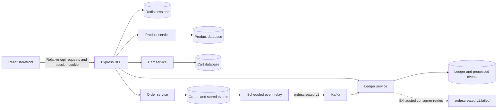

# Current application architecture

This document describes the implementation on the current PR branch. Deployment
roadmaps describe proposed infrastructure separately; they are not evidence of a
running production deployment.

## Components and ownership

The customer storefront uses React 19, TypeScript, Vite, and React Router. An
Express backend for frontend (BFF) handles browser API requests. The Maven reactor
uses Spring Boot 4.1.1 and Java 25 and contains four services and an end-to-end test
module.

| Component | Responsibility | Source |
| --- | --- | --- |
| Frontend | Discovery, cart interaction, checkout, confirmation, and history | `frontend/src` |
| BFF | Session handling, JWT verification, API routing, receipt response adaptation | `frontend/server` |
| Product service | Product catalogue, prices, availability, stock reservations | `microservices/product-service` |
| Cart service | Customer-owned cart, product snapshots, quantities, cart state | `microservices/cart-service` |
| Order service | Checkout validation, recorded order lines/totals, idempotency, event persistence | `microservices/order-service` |
| Ledger service | Order-event projection, spending summaries, receipt formatting | `microservices/ledger-service` |

Each service owns its database. PostgreSQL is used for the Docker-backed
integration flow. Redis stores BFF runtime sessions. Kafka carries internal order
events; the browser does not access Kafka or service databases.

## Shopping and checkout

A cart represents mutable purchase intent. An order records the accepted purchase;
its lines and total are persisted rather than reconstructed from the current
catalogue or browser state.

1. Customers browse products without signing in. Private cart and order operations
   require an authenticated session.
2. Cart-service validates selections against product-service data. The frontend
   displays server-confirmed cart responses and a price preview.
3. Checkout sends a cart ID and a retained idempotency key through the BFF. The BFF
   forwards the key as the backend `Idempotency-Key` header.
4. Order-service validates ownership and cart state, reserves stock, claims the
   cart, and persists the order and event intent transactionally. Compensation
   handles downstream failures; cross-service operations are not one shared
   database transaction.
5. A scheduled relay claims stored events using leases, publishes them with the
   order ID as the Kafka key, and records success or retry/terminal failure state.
6. Ledger-service validates events and applies its projection transactionally.
   Processed-event records and a unique order ID prevent duplicate ledger entries.
7. Confirmation loads the persisted owned order. Receipt readiness is separate:
   ledger processing may complete after checkout returns.

A missing receipt becomes BFF HTTP `202` with `status: "pending"` only after the
order service verifies the requested order and its ownership. Ready receipts are
returned as JSON containing plain-text content. The frontend polls with bounded
backoff and offers retry after the wait budget. Receipt delay does not instruct
the customer to submit checkout again.

## Authentication and state boundaries

The BFF calls the configured login endpoint, verifies the returned JWT using JWKS
and RS256 with issuer/audience checks, and stores it in Redis. The browser receives
public session identity and an opaque HttpOnly session cookie. The cookie is Secure
in production configuration. Upstream tokens are not returned to browser JavaScript.

Backend services enforce JWT authorization and resource ownership independently.
Frontend route guards improve navigation but are not the authorization boundary.
Browser requests use allowlisted BFF routes; the BFF forwards the stored bearer
token for protected requests.

## Schema and integration verification

Flyway migrations remain immutable once applied. Ledger V1 creates the legacy
`summary` table; V2 renames it to `ledger`, preserving data and indexes for the
current entity mapping. The migration regression test verifies retained entries
and order uniqueness. The order-to-ledger tests use separate migration locations
and explicitly activate the `docker` profile for their application contexts,
independently of Maven's unit-test profile.

Existing verification includes service tests, a migration upgrade regression,
PostgreSQL/Redpanda integration tests, frontend/BFF tests, and mocked browser
journeys. These checks establish different boundaries: mocked browser tests do
not establish live backend connectivity or production deployment readiness.

## Current limits and related documents

Checkout does not collect payment or delivery details. Ledger events do not carry
itemized order snapshots, so persisted order lines remain the source of purchase
details. Demo identity support is a development mechanism; production identity
and infrastructure readiness require deployment-specific configuration and review.

- [Implementation guide for future changes](implementation-guide.md)
- [Frontend implementation](../frontend/docs/current-implementation.md)
- [Local setup and configuration](../frontend/README.md)
- [Kafka integration](kafka-integration.md)
- [Authentication and authorization](authentication-authorization.md)
- [Production readiness review](production-readiness-review.md)
