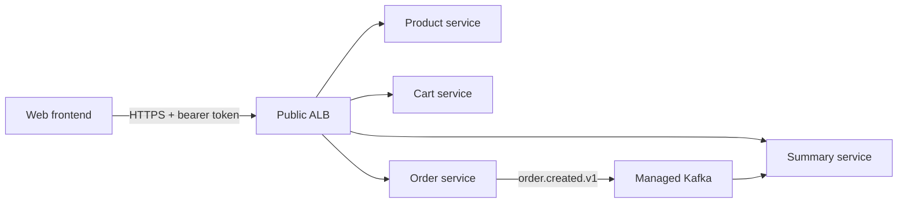

# Production Product and Integration Roadmap

## Executive Assessment

This repository contains four Spring Boot services (`product`, `cart`, `order`, and
`summary`), Docker Compose for local dependencies, Kafka-based order-summary delivery,
GitHub Actions module tests and smoke tests, and Terraform for ECS, RDS, load balancing,
secrets, and monitoring.

It does **not** contain a frontend application, a published machine-readable API contract,
or a production Kafka provisioner. The immediate product risk is therefore not another
backend feature: it is an unowned integration boundary between the future web application,
the service APIs, authentication, deployments, and support operations.

## Product Outcome

Deliver a dependable customer journey:

```text
Browse products -> manage cart -> update quantities -> checkout -> view order -> view receipt
```

The frontend owns customer interaction, client-side form state, and presentation. Backend
services own product facts, carts, orders, summaries, authorization, and asynchronous
summary generation. The frontend must never calculate trusted prices, totals, stock, or
customer identity.

## Current Alignment

| Area | Current capability | Gap to close |
| --- | --- | --- |
| Backend boundaries | Four independently deployable Spring Boot services | Standardize external API contracts and error semantics across services. |
| Checkout | Order service reads cart data and creates an immutable order | Define the browser-facing checkout contract and end-to-end acceptance path. |
| Async processing | Order event store relays `order.created.v1` to summary service | Provision and operate Kafka outside local Docker; define failed-event ownership. |
| Security | JWT and per-service security configuration exist | Define browser token lifecycle, CORS policy, public routes, and authorization test matrix. |
| Quality | Per-service Maven CI and Docker smoke tests | Add contract, end-to-end, accessibility, and browser workflow tests. |
| Infrastructure | Terraform provisions ECS, RDS, ALB, secrets, and monitoring | Establish environment promotion, migrations, alert runbooks, and the managed Kafka decision. |
| Frontend | No frontend source exists in this repository | Create or connect a dedicated frontend repository and release pipeline. |

## Target Integration Model

For the MVP, use the existing ALB as the public HTTP entry point. The frontend calls
versioned service endpoints through one configured API base URL. Do not add a BFF or API
gateway layer until cross-service composition, client-specific authorization, or API
aggregation becomes a demonstrated need.



### Contract Rules

- Publish OpenAPI documents from each service and treat them as the frontend-backend contract.
- Version externally visible breaking HTTP changes under `/api/v1` or an equivalent documented strategy; do not break a browser client through an undocumented controller rename.
- Use one shared error envelope with stable error codes, a customer-safe message, field errors, and a correlation ID.
- Keep all monetary values, IDs, dates, and pagination formats explicit in the contract. Frontend types are generated from, or verified against, the OpenAPI documents.
- Configure the frontend API base URL and allowed CORS origins per environment. Never ship localhost endpoints or secrets in browser bundles.
- Treat receipt generation as eventually consistent after checkout. The UI should show an order-confirmed state first, then poll or refresh the summary until it is available.

## Delivery Roadmap

### Phase 0 — Product and Contract Baseline (1 week)

**Backend**

- Inventory every public endpoint, authentication requirement, error response, and ownership rule in OpenAPI.
- Resolve API documentation drift before frontend development, including cart quantity update semantics and checkout inputs/outputs.
- Add a request/response example for the browse, cart, quantity update, checkout, order status, and receipt flows.

**Frontend**

- Create or select the frontend repository, framework, deployment target, and environment-variable convention.
- Define typed API client generation from OpenAPI and a shared error-handling adapter.
- Produce click-through designs and acceptance criteria for the complete journey, including loading, empty, unauthorized, conflict, and unavailable states.

**Exit gate**

- Product, frontend, and backend owners approve one versioned contract and acceptance scenarios for the customer journey.

### Phase 1 — Vertical Slice Integration (2 weeks)

**Backend**

- Ensure cart item quantity update is atomic, validates stock, and returns the canonical cart representation.
- Keep checkout idempotent at the API boundary or define an idempotency-key contract before enabling repeated browser submissions.
- Return order confirmation independently of summary availability; expose a documented summary/receipt read endpoint.
- Add CORS configuration from environment properties, restricted to approved frontend origins.

**Frontend**

- Implement product browse, cart, quantity controls, checkout, order confirmation, and receipt states using the generated client.
- Use a single authenticated request interceptor and an explicit session-expiry path.
- Disable duplicate checkout submits, show retryable failure states, and preserve safe cart draft state only in the browser.

**Integration testing**

- Add API contract tests for each client operation.
- Add one browser end-to-end test that creates a cart, changes quantity, checks out, and waits for the receipt without timing-based sleeps.

**Exit gate**

- The full journey runs against Docker Compose and a shared development environment from a clean database.

### Phase 2 — Production Reliability and Operations (2–3 weeks)

**Backend and platform**

- Choose and provision managed Kafka, or explicitly defer Kafka and document the supported deployment. Local Docker Kafka is not a production broker.
- Configure broker replication, TLS/SASL, ACLs, retention, monitoring, and secret injection. See [Kafka Integration Guide](kafka-integration.md).
- Run database migrations through a controlled migration tool before relying on production schema validation.
- Add correlation IDs to HTTP logs and propagate them into Kafka event metadata and consumer logs.
- Define dashboards and alerts for HTTP 5xx rate, latency, unavailable dependencies, order-event-store `FAILED` records, consumer lag, and failed-letter topic growth.
- Write operational runbooks for order-event replay, failed consumer record replay, rollback, and secret rotation.

**Frontend**

- Add runtime configuration for API base URL and observability endpoint; keep build artifacts environment-neutral where possible.
- Add error monitoring, release identifiers, performance budgets, accessibility checks, and content-security policy review.
- Implement a customer-support view only if the product requires it; do not expose internal Kafka or event-store details to end users.

**Exit gate**

- A staging deployment completes a failure drill: broker unavailable, downstream service unavailable, duplicate event, expired token, and rollback of a backend/frontend release.

### Phase 3 — Release Governance and Scale (continuous)

- Promote the same immutable backend images and frontend build from development to staging to production.
- Require pull-request checks: unit tests, API contract validation, dependency/security scanning, Terraform plan, frontend lint/typecheck/test, and end-to-end smoke test.
- Use feature flags for incomplete cross-layer work and define rollback ownership for each release.
- Review service-level objectives monthly: checkout success rate, p95 latency, summary availability time, failed-event count, and customer-visible error rate.
- Introduce a BFF, caching, distributed tracing platform, or workflow orchestration only when metrics and product needs justify the operational cost.

## Ownership and Working Agreement

| Decision | Accountable | Consulted | Evidence of completion |
| --- | --- | --- | --- |
| API contract and compatibility | Backend lead | Frontend lead, product | Versioned OpenAPI and contract tests |
| Customer journey and UX states | Product/frontend lead | Backend lead | Acceptance criteria and E2E test |
| Auth/session/CORS | Security/backend lead | Frontend lead | Threat review and integration tests |
| Kafka/event recovery | Backend/platform lead | Product support | Dashboard, runbook, failure drill |
| Infrastructure promotion | Platform lead | Backend/frontend leads | Reproducible staging and production release |
| Release decision | Product owner | All leads | Exit-gate evidence and rollback plan |

## Production Readiness Checklist

- [ ] API contracts are published, versioned, and consumed by the frontend client.
- [ ] All customer flows have acceptance tests and no client trusts browser-supplied totals or identities.
- [ ] JWT/session lifecycle, CORS origins, CSP, and public endpoints are reviewed for the production domain.
- [ ] Database migrations, backups, restore testing, and retention policies are in place.
- [ ] Kafka is managed, secured, monitored, and has a named owner for failed-letter replay.
- [ ] Alerts route to an accountable team and runbooks cover the failure modes they alert on.
- [ ] Frontend and backend builds have immutable versions, staging validation, and documented rollback.
- [ ] Accessibility, performance, security scanning, and error monitoring are part of release checks.

## First Planning Session

Before implementation, the product, frontend, backend, and platform owners should answer:

1. Which frontend repository and hosting model own the customer experience?
2. What is the canonical API base path and authentication/session model for the browser?
3. Which environments exist, who approves promotion, and where are their secrets managed?
4. Is managed Kafka required for the first production release, and who owns failed-event recovery?
5. What service-level objective defines a successful checkout and summary delivery?

These answers turn the roadmap into an executable release plan without prematurely adding infrastructure.
