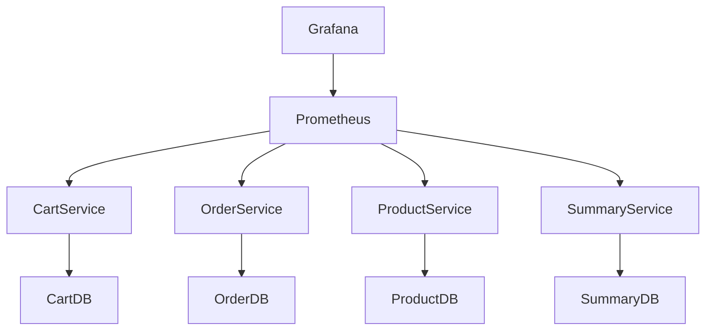

# Clean Code Grocellery App

This project is a grocery store application built with a microservices architecture. It is designed for both local development and fully automated cloud deployment to AWS.

---

## AWS Cloud Deployment Documentation

This project is architected for a fully automated, production-ready deployment to the AWS cloud. The deployment strategy is built on the principles of Infrastructure as Code (IaC) and a complete CI/CD pipeline, ensuring that deployments are reliable, repeatable, and secure.

### Infrastructure as Code (IaC) with Terraform

The entire cloud infrastructure is managed declaratively using **Terraform**, with all configuration files located in the `/terraform` directory. This IaC approach means that the complete architecture—from networking to databases to the application services themselves—is treated as code, versioned in Git, and can be created or destroyed reliably.

Key components of the AWS architecture provisioned by Terraform include:

- **Networking:** A custom, secure **Amazon VPC** is created with public and private subnets. Public-facing resources like the load balancer reside in the public subnets, while the core application and database are protected in the private subnets, inaccessible from the public internet.
- **Container Orchestration:** The microservices are deployed as Docker containers managed by **Amazon ECS (Elastic Container Service)** on **AWS Fargate**. Fargate is a serverless compute engine for containers, which removes the need to manage underlying EC2 instances, simplifying operations and scaling.
- **Database:** For cost-effectiveness in an MVP environment, all services connect to a single, shared **Amazon RDS for PostgreSQL** database instance. This provides a managed, reliable, and scalable database solution.
- **Load Balancing:** An **Application Load Balancer (ALB)** serves as the single entry point for all user traffic. It inspects the URL path of incoming requests and routes them to the appropriate microservice (e.g., requests to `/cart-service/*` are routed to the Cart Service).

### Automated CI/CD Pipeline

A continuous integration and continuous delivery (CI/CD) pipeline, built with **AWS CodePipeline**, automates the entire process of moving code from a developer's commit to a live deployment in the cloud.

The pipeline consists of the following stages:

1.  **Source:** The pipeline is automatically triggered by a `git push` to the `main` branch of the AWS CodeCommit repository.
2.  **Build:** An **AWS CodeBuild** project takes over, performing the core CI tasks. It compiles the Java code, runs unit tests with Maven (`mvn clean install`), and then builds a new Docker image for each microservice. These images are tagged and pushed to their respective **Amazon ECR (Elastic Container Registry)** repositories.
3.  **Deploy (Plan & Apply):** The deployment is handled safely in two steps:
    *   **Terraform Plan:** A second CodeBuild project runs `terraform plan`, which generates a preview of the infrastructure changes. The pipeline then **pauses for manual approval**, providing a critical safety gate to prevent accidental changes.
    *   **Terraform Apply:** Once the plan is approved in the AWS Console, the pipeline proceeds. It runs `terraform apply`, which instructs Terraform to update the infrastructure. Terraform detects the new Docker image in ECR and updates the corresponding ECS Task Definition. This action automatically triggers a **zero-downtime rolling deployment** of the new application version in ECS.

---

## Microservice-Based Development (Local)

This application is designed using the microservices architectural style, where the system is decomposed into small, independent services. Each microservice is responsible for a specific business capability and can be developed, deployed, and scaled independently.

### Microservices in This Project
- **Product Service:** Manages the product catalog and exposes product-related APIs.
- **Cart Service:** Handles shopping cart operations for users.
- **Order Service:** Manages order creation and processing.
- **Summary Service:** Generates purchase summaries and receipts.

All services communicate via REST APIs and are containerized for easy orchestration with Docker Compose. For local development, each service has its own database, codebase, and can be tested and deployed independently.

## Prerequisites

- Java 21
- Maven
- Docker
- Docker Compose

## Getting Started (Local)

### 1. Start the Databases

The project uses PostgreSQL databases for each microservice, which are managed with Docker Compose. To start the databases, run the following command from the root of the project:

```bash
docker-compose up -d
```

### 2. Configure the Application

For each microservice, you will need to create an `application.properties` file in the `src/main/resources` directory. You can do this by copying the `application.properties.example` file:

```bash
cp microservices/<service-name>/src/main/resources/application.properties.example microservices/<service-name>/src/main/resources/application.properties
```

**Note:** The example files are pre-configured with the correct database credentials for the Docker Compose setup, so you won't need to make any changes to them.

### 3. Run the Microservices

You can run each microservice using the following Maven command:

```bash
mvn spring-boot:run -pl microservices/<service-name>
```

For example, to run the `cart-service`:

```bash
mvn spring-boot:run -pl microservices/cart-service
```

The services will be available at the following ports:

- **cart-service:** 8081
- **order-service:** 8082
- **product-service:** 8083
- **summary-service:** 8084

## Quick Start

```sh
git clone <repo-url>
cd clean-code-grocellery-app
docker-compose up
```
Access services at:
- Cart: http://localhost:8081
- Order: http://localhost:8082
- Product: http://localhost:8083
- Summary: http://localhost:8084

## Service Endpoints

| Service   | Base URL              | Swagger UI                  |
|-----------|-----------------------|-----------------------------|
| Cart      | http://localhost:8081 | http://localhost:8081/swagger-ui.html |
| Order     | http://localhost:8082 | http://localhost:8082/swagger-ui.html |
| Product   | http://localhost:8083 | http://localhost:8083/swagger-ui.html |
| Summary   | http://localhost:8084 | http://localhost:8084/swagger-ui.html |

## Environment Variables

| Variable                  | Description                | Default Value         |
|---------------------------|----------------------------|----------------------|
| POSTGRES_USER             | DB username                |         |
| POSTGRES_PASSWORD         | DB password                |        |
| POSTGRES_DB               | DB name                    | grocery          |
| test-cart-service-secret  | JWT secret for cart        | dummy-cart-secret    |
| test-order-service-secret | JWT secret for order       | dummy-order-secret   |
| test-product-service-secret | JWT secret for product    | dummy-product-secret |
| test-summary-service-secret | JWT secret for summary    | dummy-summary-secret |

## Architecture



## Running Tests

To run all tests for a service:
```sh
mvn test -pl microservices/cart-service -Dspring.profiles.active=test
```

## Monitoring

- Prometheus: http://localhost:9090
- Grafana: http://localhost:3000 (default login:)

## Features

- Product management with validation
- Shopping cart operations
- Flexible discount system
- Receipt generation

## Technical Stack

- Java 21
- JUnit 5 for testing
- Maven for build automation
- GitHub Actions for CI/CD

## Project Structure

The application follows clean code principles with:

- Domain objects: [`Product`](src/main/java/grocery/Product.java), [`CartItem`](src/main/java/grocery/CartItem.java)
- Core business logic: [`ShoppingCart`](src/main/java/grocery/Shopping

## Future Work: Spring Boot Integration

Planned enhancements with Spring Boot:

- RESTful API endpoints for cart operations
- Database integration with Spring Data JPA
- Product catalog management
- User authentication and authorization
- Shopping history and order tracking
- Discount rules management interface
- Web-based shopping interface
- Containerization with Docker

### Spring Boot Migration Steps

1. Add Spring Boot dependencies to pom.xml
2. Create service layer for business logic
3. Develop repository layer for data persistence
4. Implement REST controllers for API endpoints
5. Add Spring Security for authentication
6. Design database schema for products, orders, and users
7. Create Docker configuration
8. Implement unit and integration testing

## License

This project is available under the MIT License.

## API Documentation

Each microservice exposes interactive API documentation via Swagger UI. You can access these endpoints whether running the services locally or inside Docker containers (as long as the ports are mapped):

- **cart-service:** http://localhost:8081/swagger-ui.html or http://localhost:8081/swagger-ui/index.html
- **order-service:** http://localhost:8082/swagger-ui.html or http://localhost:8082/swagger-ui/index.html
- **product-service:** http://localhost:8083/swagger-ui.html or http://localhost:8083/swagger-ui/index.html
- **summary-service:** http://localhost:8084/swagger-ui.html or http://localhost:8084/swagger-ui/index.html


If the `/swagger-ui.html` path does not work, try `/swagger-ui/index.html`.

You can also view the raw OpenAPI spec at:
- `http://localhost:<service-port>/v3/api-docs`

## Health Checks (Actuator)

Each service exposes a health endpoint via Spring Boot Actuator:

- **cart-service:** http://localhost:8081/actuator/health
- **order-service:** http://localhost:8082/actuator/health
- **product-service:** http://localhost:8083/actuator/health
- **summary-service:** http://localhost:8084/actuator/health

If you get an empty reply or 401 error, make sure the service is running and that your security configuration allows unauthenticated access to `/actuator/health`.

## Troubleshooting

- Ensure the service is running and mapped to the correct port (see `docker-compose ps`).
- If running inside Docker, make sure you are accessing the correct host port.
  
- If you get an empty reply from `/actuator/health`, check your security configuration to allow public access to actuator endpoints.
- Check service logs with `docker logs <container-name>` for errors.

## Test Credentials for Microservices

All microservices are secured with HTTP Basic authentication. 

The Swagger UI and OpenAPI documentation endpoints are publicly accessible without authentication.

## Sample Data

The product-service is preloaded with the following demo products for showcase purpose.

## JWT Authentication Integration

All microservices use JWT (JSON Web Token) authentication for securing APIs. Each service requires a unique JWT secret, which should be set via environment variables or configuration files. **Never commit real secrets to version control.**

### Setting JWT Secrets for Local Development and Testing
```
- Each service should have a unique value for `JWT_SECRET`.
- These files are ignored by git (see `.gitignore`).

### Production Secrets
- Set `JWT_SECRET` as an environment variable or in a secure config file (never commit secrets).
- Example for Docker Compose:
  ```yaml
  environment:
    - JWT_SECRET=${JWT_SECRET}
  ```

### Swagger/OpenAPI and Test Security
- All Swagger UI and OpenAPI endpoints are accessible without authentication.
- In tests, a test-specific security config disables authentication for controller tests, so you do not need to provide tokens in test code.
- To test authentication logic, create dedicated integration/security tests.

### Rotating Secrets
- To rotate a secret, update the value in your environment or test properties and restart the service.
